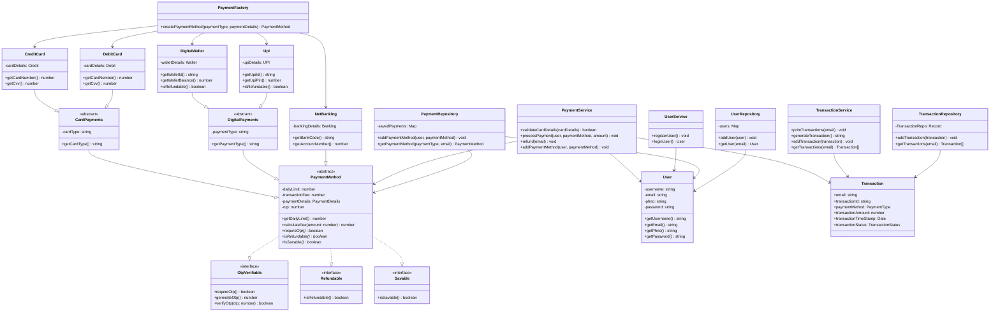

```mermaid
classDiagram
    class OtpVerifiable {
        <<interface>>
        +requireOtp() boolean
        +generateOtp() number
        +verifyOtp(otp: number) boolean
    }
    
    class Refundable {
        <<interface>>
        +isRefundable() boolean
    }
    
    class Savable {
        <<interface>>
        +isSavable() boolean
    }
    
    class PaymentMethod {
        <<abstract>>
        -dailyLimit: number
        -transactionFee: number
        -paymentDetails: PaymentDetails
        -otp: number
        +getDailyLimit() number
        +calculateFee(amount: number) number
        +requireOtp()* boolean
        +isRefundable()* boolean
        +isSavable()* boolean
    }
    
    PaymentMethod ..|> OtpVerifiable
    PaymentMethod ..|> Refundable
    PaymentMethod ..|> Savable
    
    class CardPayments {
        <<abstract>>
        -cardType: string
        +getCardType() string
    }
    
    CardPayments --|> PaymentMethod
    
    class DigitalPayments {
        <<abstract>>
        -paymentType: string
        +getPaymentType() string
    }
    
    DigitalPayments --|> PaymentMethod
    
    class CreditCard {
        -cardDetails: Credit
        +getCardNumber() number
        +getCvv() number
    }
    
    CreditCard --|> CardPayments
    
    class DebitCard {
        -cardDetails: Debit
        +getCardNumber() number
        +getCvv() number
    }
    
    DebitCard --|> CardPayments
    
    class DigitalWallet {
        -walletDetails: Wallet
        +getWalletId() string
        +getWalletBalance() number
        +isRefundable() boolean
    }
    
    DigitalWallet --|> DigitalPayments
    
    class Upi {
        -upiDetails: UPI
        +getUpiId() string
        +getUpiPin() number
        +isRefundable() boolean
    }
    
    Upi --|> DigitalPayments
    
    class NetBanking {
        -bankingDetails: Banking
        +getBankCode() string
        +getAccountNumber() number
    }
    
    NetBanking --|> PaymentMethod
    
    class User {
        -username: string
        -email: string
        -phno: string
        -password: string
        +getUsername() string
        +getEmail() string
        +getPhno() string
        +getPassword() string
    }
    
    class Transaction {
        +email: string
        +transactionId: string
        +paymentMethod: PaymentType
        +transactionAmount: number
        +transactionTimeStamp: Date
        +transactionStatus: TransactionStatus
    }
    
    class PaymentService {
        +validateCardDetails(cardDetails) boolean
        +processPayment(user, paymentMethod, amount) void
        +refund(email) void
        +addPaymentMethod(user, paymentMethod) void
    }
    
    PaymentService --> User
    PaymentService --> PaymentMethod
    PaymentService --> Transaction
    
    class TransactionService {
        +printTransactions(email) void
        +generateTransaction() string
        +addTransaction(transaction) void
        +getTransactions(email) Transaction[]
    }
    
    TransactionService --> Transaction
    
    class UserService {
        +registerUser() void
        +loginUser() User
    }
    
    UserService --> User
    
    class PaymentRepository {
        -savedPayments: Map
        +addPaymentMethod(user, paymentMethod) void
        +getPaymentMethod(paymentType, email) PaymentMethod
    }
    
    PaymentRepository --> User
    PaymentRepository --> PaymentMethod
    
    class TransactionRepository {
        -TransactionRepo: Record
        +addTransaction(transaction) void
        +getTransactions(email) Transaction[]
    }
    
    TransactionRepository --> Transaction
    
    class UserRepository {
        -users: Map
        +addUser(user) void
        +getUser(email) User
    }
    
    UserRepository --> User
    
    class PaymentFactory {
        +createPaymentMethod(paymentType, paymentDetails) PaymentMethod
    }
    
    PaymentFactory --> CreditCard
    PaymentFactory --> DebitCard
    PaymentFactory --> DigitalWallet
    PaymentFactory --> Upi
    PaymentFactory --> NetBanking
```